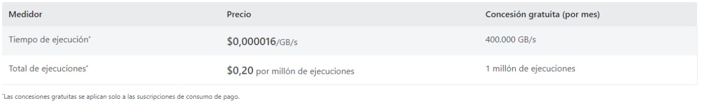

### Escuela Colombiana de Ingeniería
### Arquitecturas de Software - ARSW

## Escalamiento en Azure con Maquinas Virtuales, Sacale Sets y Service Plans
## Juan Sebastián Ospina Calderon y María José Torres Nieves

### Dependencias
* Cree una cuenta gratuita dentro de Azure. Para hacerlo puede guiarse de esta [documentación](https://azure.microsoft.com/es-es/free/students/). Al hacerlo usted contará con $100 USD para gastar durante 12 meses.
Antes de iniciar con el laboratorio, revise la siguiente documentación sobre las [Azure Functions](https://www.c-sharpcorner.com/article/an-overview-of-azure-functions/)

### Parte 0 - Entendiendo el escenario de calidad

Adjunto a este laboratorio usted podrá encontrar una aplicación totalmente desarrollada que tiene como objetivo calcular el enésimo valor de la secuencia de Fibonnaci.

**Escalabilidad**
Cuando un conjunto de usuarios consulta un enésimo número (superior a 1000000) de la secuencia de Fibonacci de forma concurrente y el sistema se encuentra bajo condiciones normales de operación, todas las peticiones deben ser respondidas y el consumo de CPU del sistema no puede superar el 70%.

### Escalabilidad Serverless (Functions)

1. Cree una Function App tal cual como se muestra en las  imagenes.

2. Instale la extensión de **Azure Functions** para Visual Studio Code.

3. Despliegue la Function de Fibonacci a Azure usando Visual Studio Code. La primera vez que lo haga se le va a pedir autenticarse, siga las instrucciones.

4. Dirijase al portal de Azure y pruebe la function.

5. Modifique la coleción de POSTMAN con NEWMAN de tal forma que pueda enviar 10 peticiones concurrentes. Verifique los resultados y presente un informe.

6. Cree una nueva Function que resuleva el problema de Fibonacci pero esta vez utilice un enfoque recursivo con memoization. Pruebe la función varias veces, después no haga nada por al menos 5 minutos. Pruebe la función de nuevo con los valores anteriores. ¿Cuál es el comportamiento?.

**Preguntas**

* ¿Qué es un Azure Function?

    Azure Function es el servicio en la nube disponible a petición que proporciona toda la infraestructura y los recursos y se actualizan continuamente, necesarios para ejecutar las aplicaciones. Por lo que los desarrolladores se centra en los fragmentos de código que más importan y Functions se ocupa del resto al proporcionar procesos serveless, responder a cambios en las bases de datos, procesar secuencias de IoT, entre otros.
* ¿Qué es serverless?

    Serverless hace referencia a un modelo de ejecución de computación en la nube en el que el proveedor de los servicios en la nube (Azure en este laboratorio) destina por demanda recursos de las máquinas virtuales, cuidando de los servidores por sus clientes.
* ¿Qué es el runtime y que implica seleccionarlo al momento de crear el Function App?

    Runtime es la infraestructura de proceso que usa Azure Data Factory (ADF) para proporcionar varias funcionalidades de integración de datos en distintos entornos de red.
    Al seleccionarlo cuando se crea el Function App permite aprovisionarla para una o más funciones así que se puede elegir entre "pago por uso" o un plan de servicio de aplicaciones (dimensiona el host para sus funciones).
* ¿Por qué es necesario crear un Storage Account de la mano de un Function App?

    Esto es necesario ya que Azure Functions usa Azure Storage con ciertas operaciones como la administración de los desencadenadores y ejecutar las funciones de registro.
* ¿Cuáles son los tipos de planes para un Function App?, ¿En qué se diferencias?, mencione ventajas y desventajas de cada uno de ellos.

    Plan de consumo: Escala de forma automática (incluso durante períodos de carga elevada), pago por los recursos de proceso solo cuando se ejecuten las funciones y las instancias del host de Functions se agregan y quitan de forma dinámica según el número de eventos de entrada.

    Plan Premium: Escala automáticamente en función de la demanda mediante trabajos preparados previamente que ejecutan aplicaciones sin ningún retraso después de estar inactivas, ejecución en instancias más eficaces y se conecta a redes virtuales.

    Plan dedicado: Ejecución de las funciones en un plan de App Service a los Precios de App Service normales; se usa cuando se tienen máquinas virtuales infrautilizadas que ya ejecutan otras instancias de App Service o se requieren escalado y costos predictivos.
* ¿Por qué la memoization falla o no funciona de forma correcta?

    La memorización falla ya que después de que se deja el uso, la función se restablece perdiendo la memorización.
* ¿Cómo funciona el sistema de facturación de las Function App?

    Se divide en:

    * Consumo: Se factura en función del consumo de recursos y las ejecuciones por segundo. Los precios del plan de consumo incluyen una concesión gratuita mensual de 1 millones de solicitudes y 400.000 GB-segundos de consumo de recursos por suscripción en el modelo de precios de pago por uso, para todas las aplicaciones de funciones de esa suscripción. El plan Azure Functions Premium proporciona un rendimiento mejorado y se factura por segundo en función del número de vCPU/s y de GB/s que consuman sus funciones premium. Los clientes también puede ejecutar Functions dentro de su plan de App Service a las tarifas normales del plan de App Service.

        

    * Plan Premium: Ofrece a los clientes las mismas características y el mismo mecanismo de escalado que se utilizan en el plan Consumo (basado en el número de eventos) sin arranque en frío, con rendimiento mejorado y acceso a VNET y se basa en el número de núcleos por segundo y en la memoria asignada en todas las instancias. No hay ningún cargo por la ejecución con el plan Prémium. Debe haber al menos una instancia asignada en todo momento en cada plan. Si desea obtener más información, consulte los detalles del plan Prémium de Azure. Cuando cree o escale un plan, podrá elegir entre tres tamaños de instancia. Se facturará la cantidad total de memoria y núcleos aprovisionados, por los segundos que tenga asignada cada instancia. La aplicación puede escalarse horizontalmente de forma automática a varias instancias cuando sea necesario.

        

    * Functions en Kubernetes (versión preliminar): Esta funcionalidad es gratis ahora, durante la versión preliminar; tendiendo en cuenta que los clientes deberán pagar por la infraestructura de Kubernetes subyacente.

    * Ejecuciones: Functions se factura según el número total de ejecuciones solicitadas cada mes para todas las funciones y se cuentan cada vez que se ejecuta una función en respuesta a un evento, desencadenado por un enlace. El primer millón de ejecuciones es gratis cada mes.

    * Consumo de recursos: Functions se factura según el consumo de recursos observado, medido en gigabytes por segundos (GB-s) y se calcula multiplicando el tamaño medio de memoria en GB por el tiempo en milisegundos que dura la ejecución de la función. Los precios de Functions incluyen una concesión gratuita al mes de 400.000 GB-segundos.

    * Functions Proxies: Para Functions Proxies, se aplican los mismos precios. Si un proxy desencadena una función, la ejecución y el uso de memoria de la función se cuentan aparte.

* Informe

    
    
    
